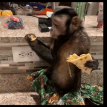
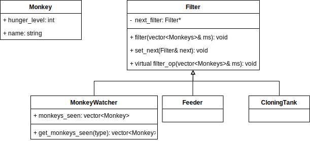

# 270191U025-Software-Architecture-assignment-5

In the lecture the concept of architectural patterns were introduced. A difference between design patterns and architectural patterns is the scale at which they apply. Architectural patterns have a bigger scale in the sense they govern the structure of the whole application and they are often composed using several design patterns.

Today’s exercise will look at the Pipes and filters pattern.
The pattern is inspired by the Unix worlds pipe operators that can be chained together to such that the output of one command is passed to the other.
For example to delete all files with the extension zip in the current directory the following can be used:

```bash
ls | grep ".zip" | xargs rm
```

Here the symbol | is used to pipe the output of one command to the next in the chain.

We will now look how this idea can be used to make reusable software blocks that can be composed using the pipes and filter pattern.

<div>
<centering>



</centering>
</div>

In the exercise we consider again the example of feeding monkeys in a zoo!
Consider the scenario depicted in the image below, here we:

1. Create a list of monkeys
2. Pass the monkeys into the feeder
3. Pass the monkeys into the cloning-tank to create identical copies of them
4. pass all the monkeys to a monkey watcher, which notes the names and hunger levels of each monkey.

Note that while the occurence of the term 'filter' in the patterns implies that each block remove something from the list, this is not always the case.
At its core the idea is that each block somehow transforms the data passed into it and which is subsequently fed into the following block.

<div>

</div>

## Exercise

Consider the diagram class diagram shown in the figure below:

<div>

</div>
Here the `Filter` class is a abstract base class that provides implementations for all but the `filter_op` method.
The classes `MonkeyWatcher`, `Feeder`, and `CloningTank` are all dervied from the `Filter` class and each implement the `filter_op` method.

The `Monkey` class represents the data flowing through the pipes and filters.

The following pesudo code, shows how the pipeline is configured and how the filtering proces occurs.

```cpp
// pseudo-code

vector<monkeys> monkeys{...};

ConcreteFilterA a;
ConcreteFilterB b;
ConcreteFilterC c;

a.set_next(&b).set_next(&c);
a.filter(&monkeys);

c.get_result()
```

For this particular realization of the pipes and filter pattern, the _pipe_ part of the pattern is establish by the call to `set_next`.
However, this may vary between different use cases, for example the pipe could be an queue inside the program or it could be an connection sending lists of monkeys between different computers, each implementing part of the filtering process.

### Tasks

1. Examine the `test_filters.cpp` and compare it with the class diagram. Make sure you understand the role of each class.

2. Implement the `MonkeyWatcher` class, re-run the test to verify that the first test section passes.

3. Implement the `Feeder` class. This should decrease the hunger level of all monkeys passed through it by 1. Re-run the test to verify that the second test section passes.

4. Implement the `CloningTank` this should insert a copy of each monkey into the list. Re-run the test to verify that all test sections passes.
